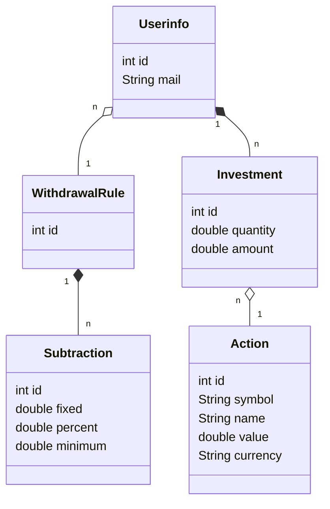

# Investments Management App
Mobile application using Flutter and Serverpod to manage his investments.

## Class diagram

```mermaid
classDiagram
%% Relationships
Userinfo "n" o-- "1" WithdrawalRule
WithdrawalRule "1" *-- "n" Subtraction
Userinfo "1" *-- "n" Investment
Investment "n" o-- "1" Action


%% Classes
class Userinfo {
    int id
    String mail
}

class Investment {
    int id
    double quantity
    double amount
}

class Action {
    int id
    String symbol
    String name
    double value
    String currency
}

class WithdrawalRule {
    int id
}

class Subtraction {
    int id
    double fixed
    double percent
    double minimum
}
```